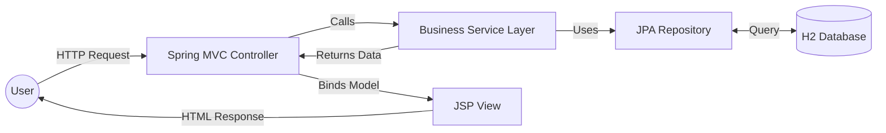
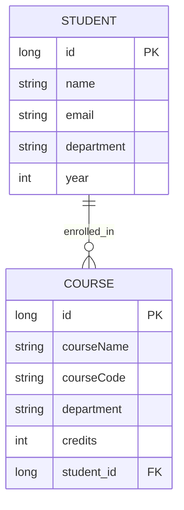

# 🎓 Student & Course Manager

This project is a simple Spring Boot application I built to manage student enrollments and course details using MVC architecture.

---

## 🚀 Features

- **Student Management**  
  Create, view, and update student profiles.

- **Course Enrollment**  
  Assign students to courses with validation.

- **Dynamic UI**  
  Responsive JSP-based interface with custom styling.

- **Data Integrity**  
  Managed relationships using JPA and server-side validation.

---

## 🛠️ Tech Stack

- **Backend:** Java 17, Spring Boot 3.2.5  
- **Persistence:** Spring Data JPA, Hibernate  
- **Database:** H2 (In-memory)  
- **Frontend:** JSP, JSTL, CSS3  
- **Build Tool:** Maven  

---

## 📊 Architecture

### 🔹 System Flow (MVC)

### 🔹 Entity Relationship


## 🏁 How to Run

### 1. Clone the Repository
```bash
git clone https://github.com/akankshakasula/student-course-manager.git
```

### 2. Navigate to Project Folder
```bash
cd student-course-manager
```

### 3. Run the Application
```bash
mvn spring-boot:run
```

### 4. Access the Application

- **Home Page:** http://localhost:8080  
- **H2 Console:** http://localhost:8080/h2-console  
  - **JDBC URL:** `jdbc:h2:mem:testdb`

---

### 📌 Note
This project was built as part of a database application assignment.

## 👩‍💻 Author
Akanksha Kasula

## 📌 About
This project was developed as part of my assignment to understand Spring Boot, MVC architecture, and database handling.
