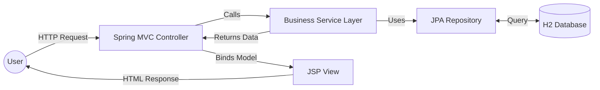
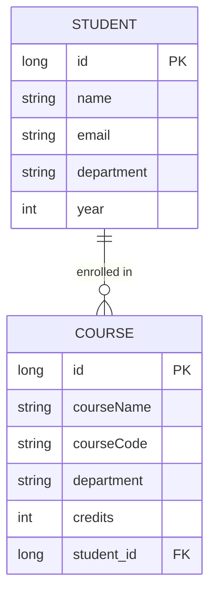

# Student & Course Manager 🎓

A robust Spring Boot application designed to manage student enrollments and course assignments. Built with a focus on clean MVC architecture and persistent data management.

## 🚀 Features

- **Student Management:** Create, Read, and Update student profiles.
- **Course Enrollment:** Assign students to specific courses with validation.
- **Dynamic Views:** Responsive JSP-based interface with custom CSS.
- **Data Integrity:** Server-side validation and JPA-managed relationships.

## 🛠️ Tech Stack

- **Backend:** Java 17, Spring Boot 3.2.5
- **Persistence:** Spring Data JPA, Hibernate
- **Database:** H2 (In-memory)
- **Frontend:** JSP, JSTL, CSS3
- **Build Tool:** Maven

## 📊 Architecture

### System Flow (MVC)



### Entity Relationship



## 🏁 How to Run

1. **Clone the repository:**

   ```bash
   git clone https://code.xeze.org/cs/student-course-manager
   ```
2. **Run with Maven:**

   ```bash
   mvn spring-boot:run
   ```
3. **Access the application:**

   - Home Page: `http://localhost:8080`
   - H2 Console: `http://localhost:8080/h2-console` (JDBC URL: `jdbc:h2:mem:testdb`)

---

Built for building-database-applications.
